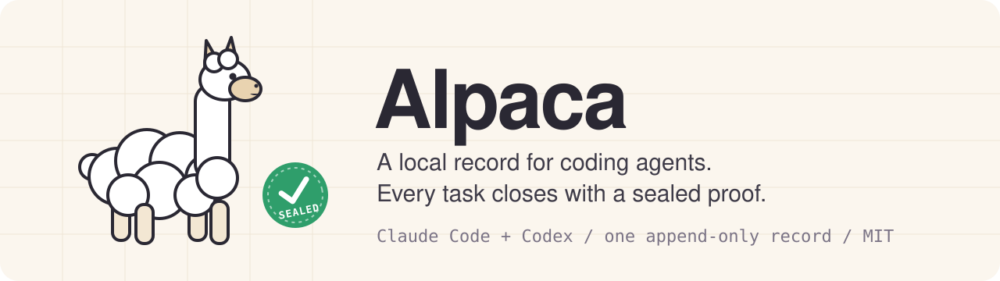
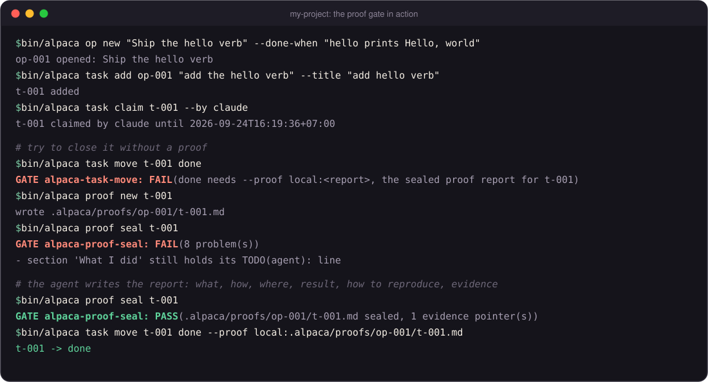

<p align="center">
  
</p>

<p align="center">
  <a href="LICENSE"></a>
  
  
  
  
</p>

<p align="center">
  <a href="#quickstart"><b>Quickstart</b></a> &middot;
  <a href="#how-it-works"><b>How it works</b></a> &middot;
  <a href="#whats-inside"><b>What's inside</b></a> &middot;
  <a href="#autodrive-levels"><b>Autodrive levels</b></a> &middot;
  <a href="MANUAL.md"><b>Manual</b></a>
</p>

---

Your coding agent says the task is done. Alpaca asks it to show the proof.

Alpaca is an engineering harness for **Claude Code** and **Codex**.

- Every session writes into one local record.
- A task closes only with a sealed proof report.
- The next session starts from `RESUME.md`.
- Both agents share the same record.

Alpaca is domain-neutral. A domain plugs in as a profile, named by the `profile:` key in `project.yaml`. The profile brings its own stages and acceptance cards. Without one, Alpaca runs as the generic harness.

## Why Alpaca

| Without it | With Alpaca |
| --- | --- |
| "Done!" with nothing to check | `alpaca task move <id> done` fails until a sealed proof report exists |
| Every new chat starts from zero | `RESUME.md` prints at session start: open ops, open tasks, the last events |
| Claude Code and Codex keep separate notes | Both write one record, `.alpaca/alpaca.db` |
| An agent deploys on its own | `alpaca deploy` pauses (exit 3) for a human decision, at every autodrive level |
| A private value slips into a public push | The pre-push barrier scans every outgoing object and blocks protected paths and sealed terms |

## Quickstart

From a git clone (Python 3.10 or newer with venv support):

```sh
git clone <repository-url> my-project
cd my-project
bash setup/bootstrap.sh
bin/alpaca onboard --name my-project --who alex:owner --what "One line on what this project builds"
bin/alpaca doctor
```

That is the whole install. Then open Claude Code or Codex in the folder.

Bootstrap creates a local Python environment inside the copy. It changes no global agent configuration.

<details>
<summary><b>Onboarding flags and notes</b></summary>

- `--who` takes `name:role` pairs, separated by commas.
- `--task "..."` adds one open task. Repeat it for more.
- `--preset plain-writing` turns on the plain-writing rules.
- Answers go into the shipped `project.yaml`. Every other key stays.
- Onboarding keeps the template's `commands` (they build and test Alpaca itself) unless it finds a Makefile, a package.json or a pytest.ini of the project's own, so edit `commands` in project.yaml to name your project's build, test, lint and run.
- After onboarding, `bin/alpaca doctor` prints no ERROR line. The WARN "no transcript dir yet" clears after the first Claude Code session.

</details>

## How it works

<picture>
  <source media="(prefers-color-scheme: dark)" srcset="docs/assets/architecture-dark.png">
  
</picture>

- Agents talk to one CLI.
- The CLI writes one record.
- Gates stand in between.
- Views are rebuilt from the record.

### The task state machine

<picture>
  <source media="(prefers-color-scheme: dark)" srcset="docs/assets/task-fsm-dark.png">
  
</picture>

| Move | Rule |
| --- | --- |
| `claim` | Only from `open`. Takes a lease. |
| lease ends | The task goes back to `open`. |
| `done` | Needs a sealed proof report. |
| `op close` | Blocked while any task is not done. |

### See it run

<p align="center">
  
</p>

<sub>Output from a fresh clone, trimmed to the lines that matter.</sub>

## What's inside

<table>
  <tr>
    <td width="50%" valign="top">
      <h3>&#x1F4D2; Record and resume</h3>
      One append-only record per project.<br>Each session opens on <code>RESUME.md</code>.
    </td>
    <td width="50%" valign="top">
      <h3>&#x1F50F; Sealed proof reports</h3>
      Write it, seal it, close with it.<br>Failed attempts stay on the record.
    </td>
  </tr>
  <tr>
    <td valign="top">
      <h3>&#x1F6A6; Gates with exit codes</h3>
      <code>0</code> PASS &middot; <code>1</code> FAIL &middot; <code>2</code> BLOCKED &middot; <code>3</code> PAUSED<br>Scripts and agents read the same verdict.
    </td>
    <td valign="top">
      <h3>&#x1F4CA; Cockpit and analytics</h3>
      <code>alpaca serve</code> runs the hub and cockpit.<br>Analytics is one HTML file that reads on a phone.
    </td>
  </tr>
  <tr>
    <td valign="top">
      <h3>&#x1F4DD; From notes to a runbook</h3>
      <code>alpaca start &lt;notes&gt;</code> turns notes into a spec, a runbook and tasks.<br>spec-kit and OpenSpec ship offline.
    </td>
    <td valign="top">
      <h3>&#x1F6E1;&#xFE0F; Barrier and clean shipping</h3>
      A pre-push barrier scans every outgoing object.<br>Reproducible archives, verified backups.
    </td>
  </tr>
</table>

Also in the box:

- **Formations** for work that needs more than one agent: `solo`, `builder-verifier`, `fan-out`, `bug-loop`, `nuclear`, `napalm`.
- **Claude Code skills**, ready in any clone: `/alpaca-first-chat`, `/alpaca-onboard`, `/alpaca-op`, `/alpaca-from-notes`, `/alpaca-interview`, `/alpaca-runbook-forge`.

## Autodrive levels

Autonomy is one ladder. You set the level; an agent may drop to a safer rung but never raises its own. A fresh install runs at **L2**.

| Level | Name | What the agent does | What you do |
| --- | --- | --- | --- |
| L1 | Assist | Investigates and hands over ready-to-run changes; writes nothing | Apply every change |
| L2 | Partial | Makes single bounded edits, one at a time | Approve each edit |
| L3 | Conditional | Runs a task end to end, hands back at every fork or irreversible step | Decide at the forks |
| L4 | High | Works alone inside one declared scope and checks its own work | Set the scope |
| L5 | Full | Plans and runs the whole task, reports what it could not finish | Read the end report |
| L6 | Never-defer | Pursues the goal until the goal marker is written | Set the goal, stop it any time |

Ship, release close, and irreversible external actions stay human decisions at every level.

## Docs

| Read this | For |
| --- | --- |
| [`MANUAL.md`](MANUAL.md) / [`docs/manual.html`](docs/manual.html) | Every verb, daily use, the hooks, troubleshooting (the HTML copy reads on a phone) |
| [`docs/DESIGN.md`](docs/DESIGN.md) | Architecture: the record, adapters, proofs, profiles, views |
| [`docs/operators.md`](docs/operators.md) | Claude Code and Codex side by side |
| [`docs/operations-hub.md`](docs/operations-hub.md), [`docs/host-hub.md`](docs/host-hub.md) | The hub, the cockpit, sign-in |
| [`docs/observability-operations.md`](docs/observability-operations.md) | The collector, artifacts, backup and restore |
| [`docs/runbook-format.md`](docs/runbook-format.md), [`docs/intake.md`](docs/intake.md) | Runbooks and turning a spec into work |
| [`docs/shipping.md`](docs/shipping.md), [`docs/DEPLOY.md`](docs/DEPLOY.md) | Packaging and moving Alpaca to another machine |

<details>
<summary><b>Start from a release archive</b></summary>

1. Extract the release archive and enter its directory. The directory may be renamed.
2. Run `bash setup/bootstrap.sh`. This creates a local Python environment inside this copy and installs nothing else. Python 3.10 or newer with venv support is required.
3. Open Claude Code or Codex in that directory. For a shell check, run `bin/alpaca --help`, then `bin/alpaca doctor`.
4. The first chat runs onboarding: answer the questions, run `bin/alpaca onboard ...` once (flags as in the Quickstart), then `bin/alpaca doctor`.

Claude Code has native lifecycle hooks. Codex follows AGENTS.md and uses explicit lifecycle commands. Both write one local Alpaca record. No global agent configuration is modified.

</details>

<details>
<summary><b>What ships in the box</b></summary>

- `alpaca/`, `bin/alpaca`, `ALPACA-MANIFEST`: the harness mechanisms. `alpaca/` is the Python package; its self-tests live in `alpaca/tests/`.
- `.alpaca/`: fresh per-installation runtime created on use; never shipped.
- `MANUAL.md` and `docs/manual.html`: command reference and phone-readable manual.
- `doctrine/`, `MAP.md`, `contracts/`, `formations/`: the rules, the boot router, and the work shapes.
- `.claude/skills/alpaca-*`: Alpaca's own skills (`/alpaca-first-chat`, `/alpaca-onboard`, `/alpaca-op`, `/alpaca-from-notes`, `/alpaca-interview`, `/alpaca-runbook-forge`). They are project skills, so Claude Code offers them in any clone with nothing to install.
- `plugin/alpaca/`: optional bundled skills (load with `claude --plugin-dir ./plugin/alpaca`, see `docs/operators.md`).
- `docs/runbook-format.md`, `templates/runbook-example/` and `/alpaca-runbook-forge`: the runbook format (a domain's stages, checks, knobs, retry rules and owner gates), a worked example, and the skill that writes a runbook from a spec. `alpaca runbook check` checks one.
- `alpaca intake <spec> <runbook>`: turns a spec-kit or OpenSpec spec and its runbook into the op's checklist rows (one per success criterion or scenario), one task contract per stage and per owner gate, and the profile stages; after a spec change it supersedes only the rows that changed. `--dry-run` shows the plan. See `docs/intake.md`.
- `/alpaca-from-notes` and `alpaca start <notes>`: the one entry point from raw notes. It picks spec-kit for a new thing and OpenSpec for a change (you can override), then walks the notes to a spec, a runbook and intake.
- `alpaca note`, `alpaca interview` and `/alpaca-interview`: raw notes go to an inbox (`input/notes/`), and an interview in rounds of questions settles every slot a runbook needs (done bar, numbers, edge cases, failures, what must never happen, owner gates), reads it back and signs it off before the spec step. See `docs/interview.md`.

</details>

<details>
<summary><b>Choices kept on purpose</b></summary>

- The wiki's generic marking rules keep their Vietnamese text. `alpaca/wiki/ingest/firewall.py` matches classification markings in several languages (Chinese, Russian and Vietnamese next to the English ones), and `alpaca/wiki/engine/echo.py` reads Vietnamese attribution cues next to the English ones. The text is there so those markings and cues are caught; it is not a leftover.
- There is no migration path from an install of the earlier internal harness that Alpaca grew from. Start a project from a fresh clone of Alpaca and onboard it; a record from that earlier install is not converted.

</details>

## Development

```sh
bin/alpaca-python -m pytest                 # the regression suite
bin/alpaca-python setup/ship.py --help      # clean, reproducible packaging
```

Never ship a live directory with `cp -r`. The exporter excludes sessions, evidence, tool installs, caches, local settings and worktrees; third-party notices travel with the package.

## License

MIT, see [`LICENSE`](LICENSE). Bundled third-party pieces (IBM Plex fonts, spec-kit, OpenSpec and others) keep their own licenses, listed in [`THIRD-PARTY-NOTICES.md`](THIRD-PARTY-NOTICES.md).
