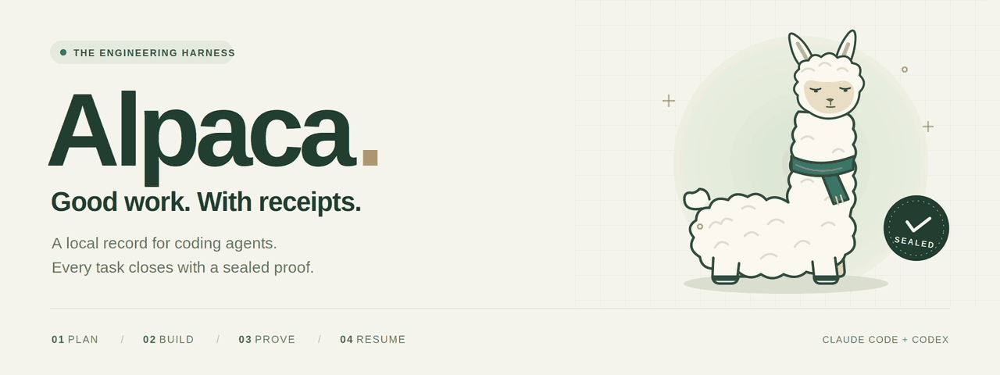
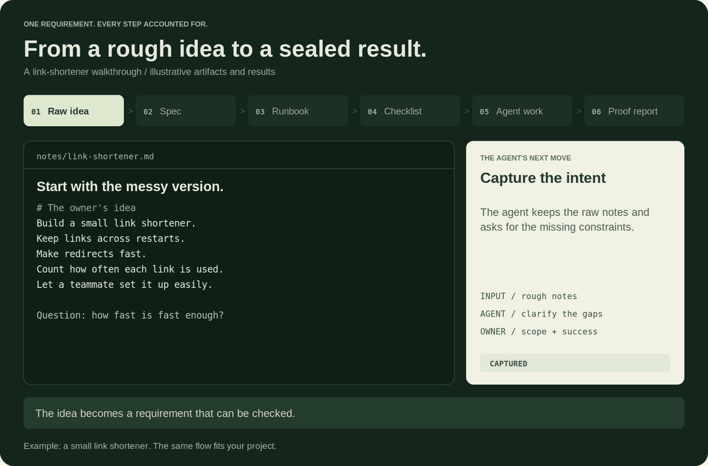
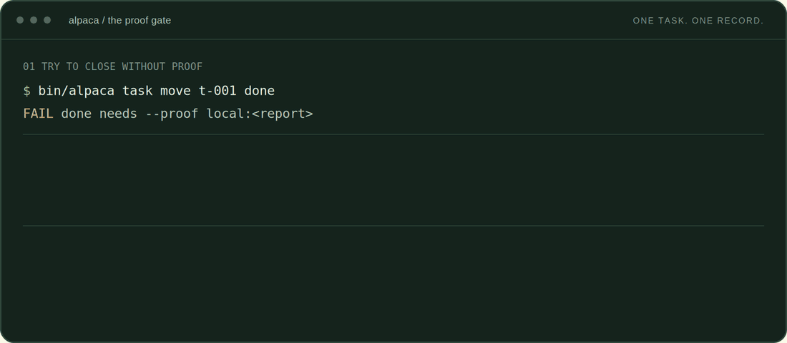
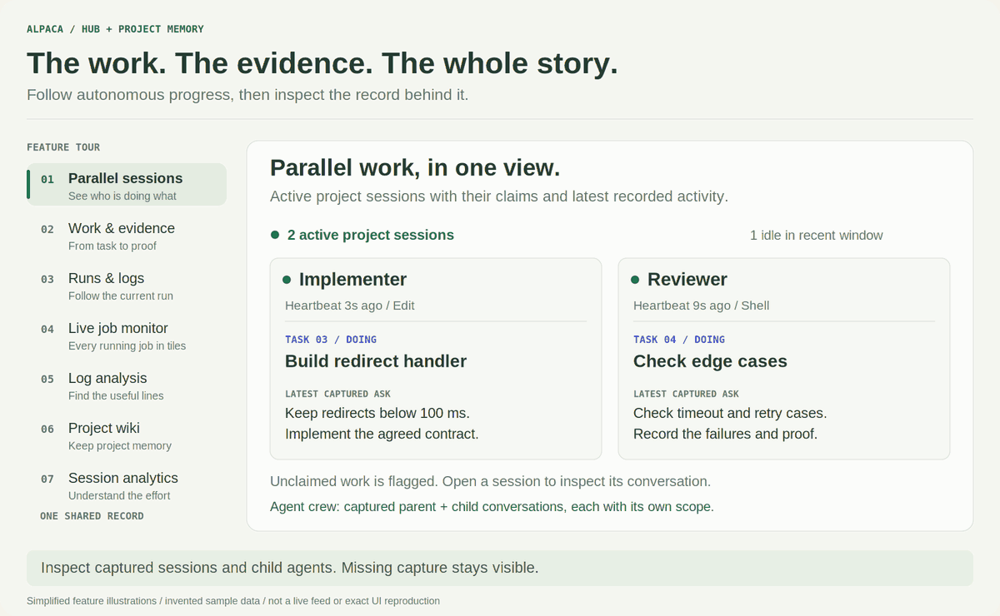
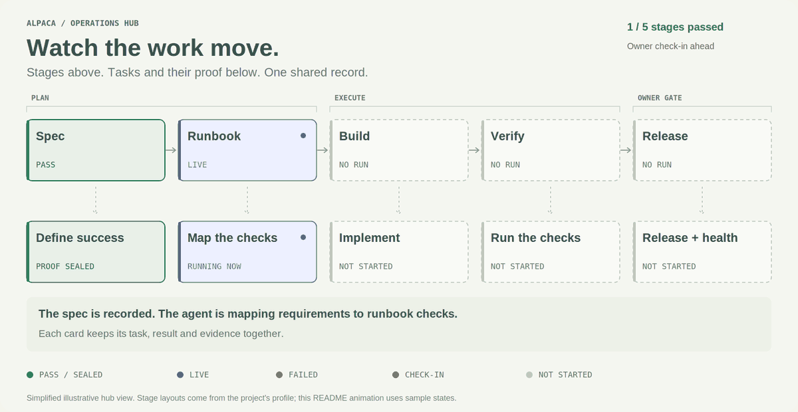
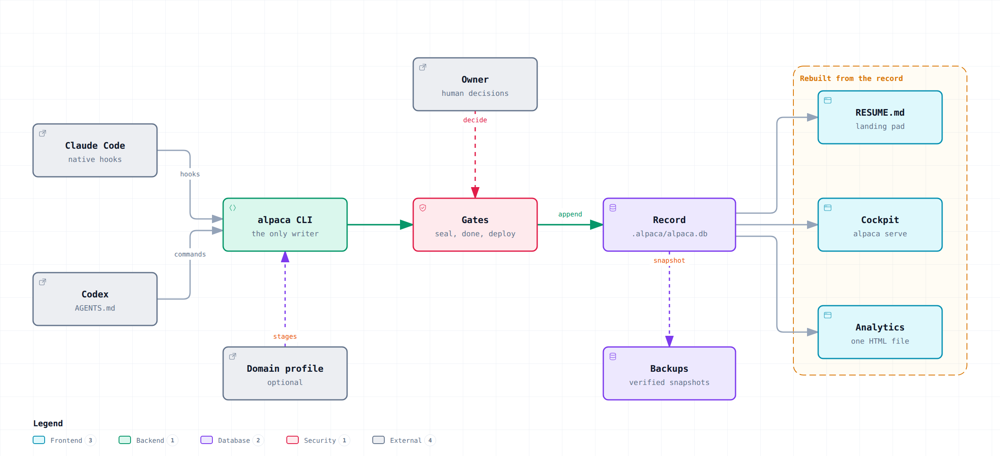
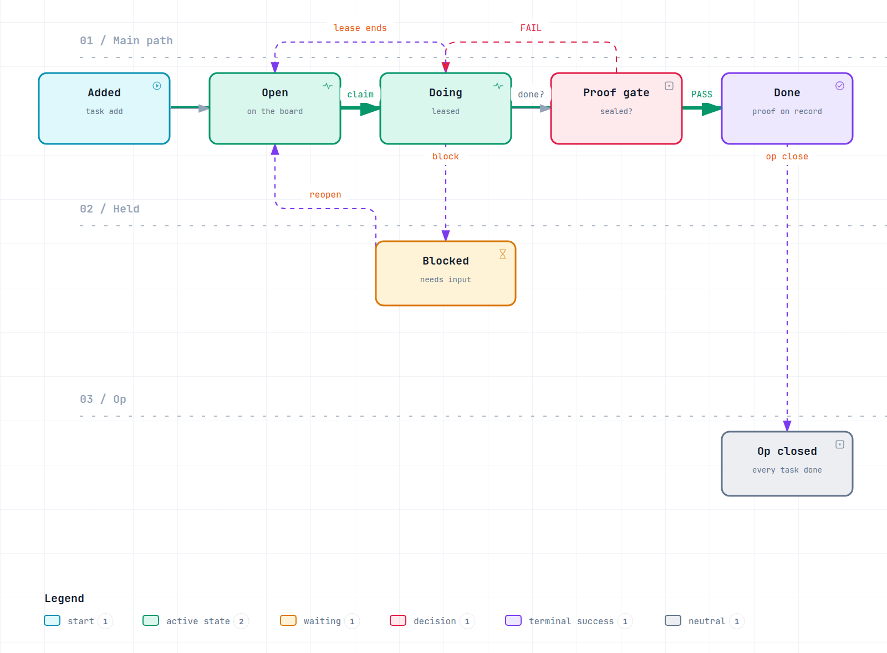

<p align="center">
  <picture>
    <source media="(prefers-reduced-motion: reduce)" srcset="docs/assets/banner.svg">
    
  </picture>
</p>

<p align="center">
  <a href="LICENSE"></a>
  
  
  
</p>

<p align="center">
  <a href="#quickstart"><b>Quickstart</b></a> &middot;
  <a href="#from-idea-to-proof"><b>Idea to proof</b></a> &middot;
  <a href="#watch-it-in-the-hub"><b>The hub</b></a> &middot;
  <a href="#autonomous-progress"><b>Autonomous progress</b></a> &middot;
  <a href="MANUAL.md"><b>Read the manual</b></a>
</p>

# Start with an idea. Finish with proof.

**Alpaca is an engineering harness for Claude Code and Codex.** Your agent takes a rough idea through a spec, a runbook, tracked work and checked results. Alpaca keeps the artifacts, decisions and evidence in one local record, so progress survives the session and completion can be inspected.

## From idea to proof

**Raw idea &rarr; spec &rarr; runbook &rarr; checklist &rarr; agent work &rarr; proof report.** Each step leaves an artifact the next step can use. Follow one requirement through the whole loop:

<p align="center">
  <picture>
    <source media="(prefers-reduced-motion: reduce)" srcset="docs/assets/workflow.svg">
    
  </picture>
</p>

<sub>Animated walkthrough of the bundled link-shortener example. Results are illustrative, not benchmark measurements. [Replay or enlarge](docs/assets/workflow.gif) &middot; [View the still](docs/assets/workflow.svg).</sub>

### 1. Raw idea: keep the intent, find the gaps

> "Build a small link shortener. Keep links across restarts, make redirects fast, and let a teammate set it up easily."

Start with notes, a rough brief, or a pasted idea. The agent saves the original words and clarifies the missing constraints: who uses it, what success means, and which decisions belong to you.

```sh
bin/alpaca start notes/link-shortener.md --prepare
```

`start` selects and prepares the bundled spec tools and prints the next steps. The agent follows that flow. In Claude Code, `/alpaca-from-notes` walks the preparation, spec, runbook and intake steps; Codex can follow the same printed steps and project instructions.

### 2. Spec: turn "fast" into something testable

For a new project, **spec-kit** turns the idea into user stories, functional requirements and measurable success criteria. **OpenSpec** handles changes to an existing specification. The agent asks the clarification questions before carrying a vague requirement into the plan.

Our example becomes:

> **SC-002:** A redirect answers within 50 ms at the 95th percentile under 200 requests per second.

That ID stays with the work. You can trace `SC-002` from the [spec](templates/runbook-example/spec.md) to its checks, checklist row, results and proof.

### 3. Runbook: decide how the work will be done and checked

The agent forges `runbook.yaml` from the spec. It names the stages, dependencies, commands, expected outputs, pass checks, permitted retries and owner gates. Each check names the requirements it covers.

For `SC-002`, the [worked runbook](templates/runbook-example/runbook.yaml) includes this check:

```yaml
- id: redirect-p95
  type: json-field
  path: out/load.json
  field: redirect.p95_ms
  op: "<="
  value: ${P95_LIMIT_MS}
  covers: [SC-002]
```

The same runbook sets the latency limit to **50 ms**, the load to **200 requests/second**, and marks both as owner-only settings. It permits up to **three load-test attempts**, increasing `WORKERS` by two when the latency check fails. A wrong redirect status ends the attempt sequence.

```sh
bin/alpaca runbook check path/to/runbook.yaml --spec path/to/spec.md
```

Coverage must pass before intake: every required criterion or scenario needs a check or an owner gate. A planned check describes how to prove a requirement; the agent still has to run the work and collect the result.

### 4. Checklist: turn the runbook into work the agent can claim

```sh
# With an op open, inspect the plan before recording it.
bin/alpaca intake path/to/spec.md path/to/runbook.yaml --dry-run
bin/alpaca intake path/to/spec.md path/to/runbook.yaml
```

Intake generates three connected pieces:

| Artifact | What it gives the agent |
| --- | --- |
| **Checklist rows** | One row per required success criterion or scenario, linked to the checks that cover it |
| **Task contracts** | Work for each command stage and owner gate, with inputs, expected outputs, a done bar and known failures |
| **Profile stages** | The stages the project uses to organize execution |

`SC-002` now has a checklist row and a load-test task with a concrete result to produce. You can inspect both with `bin/alpaca board show --op <op>` and `bin/alpaca task list --op <op>`.

When the spec changes, run intake again. It keeps unchanged rows and their verdicts, supersedes affected rows, adds new ones, and withdraws removed requirements under the applicable gates. The previous record stays available.

### 5. Agent work: claim, implement, check, recover

The agent reads a task contract, claims the task, follows the runbook's dependencies, implements the work, and runs the commands and checks. Its autonomy follows the level and scope you authorized.

Here is the retry path in the animation, using illustrative results:

| Attempt | Result | What happens next |
| --- | --- | --- |
| 1: two workers | 68.4 ms p95, **FAIL** | Record the failure; apply the permitted worker-count change |
| 2: four workers | 41.2 ms p95, **PASS** | Keep the evidence and write the report |
| Wrong redirect status, missing inputs, or exhausted retries | No completed result | Stop that path and surface the failure or blocker |

The requirement stays at 50 ms and 200 requests/second throughout. A retry changes only settings the runbook permits. A passing check supplies evidence; closing the work also needs a sealed report.

### 6. Proof report: make the result inspectable

The agent writes the report an engineer would hand over:

| Section | What the reader can check |
| --- | --- |
| **What I did** | The requirement addressed and the change made |
| **How I did it** | The approach, commands and settings used |
| **Where** | The files, stages and outputs involved |
| **Result** | Observed values against the original acceptance criteria |
| **Deviations and issues** | Failed attempts, blockers, departures and how they were handled |
| **How to reproduce** | The steps someone else can run |
| **Evidence** | Resolvable pointers to results, logs, artifacts and record events |

Alpaca fills the report header and mechanical appendix from the record. Sealing checks the written sections, resolves and hashes the evidence, preserves local evidence copies, and records the seal. It checks that the report is complete and its evidence is intact; the actual tests and review establish whether the work meets the requirement.

**Closing a task, or manually moving a checklist row to done, requires a report sealed for that ID.** Checklist rows can also be discharged through their recorded check results or owner decisions. A task's proof does not automatically discharge every requirement it touches. The next authorized piece of work can then continue, with the results and remaining obligations available to the next session.

## See the proof gate

An agent tries to close a task. The gate asks for proof. Once the agent writes and seals its report, the task can close.

<p align="center">
  <picture>
    <source media="(prefers-reduced-motion: reduce)" srcset="docs/assets/terminal.svg">
    
  </picture>
</p>

<sub>Illustrative CLI excerpt for an already claimed task. [Still demo](docs/assets/terminal.svg) &middot; [Still banner](docs/assets/banner.svg)</sub>

<details>
<summary><b>Read the demo as text</b></summary>

```sh
# A claimed task cannot close without a sealed proof report.
bin/alpaca task move t-001 done
# FAIL: done needs --proof local:<report>

# Create the report, then fill in what changed, the result, and the evidence.
bin/alpaca proof new t-001
# Edit .alpaca/proofs/op-001/t-001.md before sealing it.
bin/alpaca proof seal t-001
# PASS: the completed report and its evidence are sealed.

bin/alpaca task move t-001 done --proof local:.alpaca/proofs/op-001/t-001.md
# t-001 -> done
```

</details>

## Quickstart

From a git clone (Python 3.10 or newer with venv support):

```sh
git clone <repository-url> my-project
cd my-project
bash setup/bootstrap.sh
bin/alpaca onboard --name my-project --who alex:owner --what "One line on what this project builds"
bin/alpaca doctor
```

That is the whole install. Then open Claude Code or Codex in the folder.

Bootstrap creates a local Python environment inside the copy. It changes no global agent configuration.

<details>
<summary><b>Onboarding flags and notes</b></summary>

- `--who` takes `name:role` pairs, separated by commas.
- `--task "..."` adds one open task. Repeat it for more.
- `--preset plain-writing` turns on the plain-writing rules.
- Answers go into the shipped `project.yaml`. Every other key stays.
- Onboarding keeps the template's `commands` (they build and test Alpaca itself) unless it finds a Makefile, a package.json or a pytest.ini of the project's own, so edit `commands` in project.yaml to name your project's build, test, lint and run.
- After onboarding, `bin/alpaca doctor` prints no ERROR line. The WARN "no transcript dir yet" clears after the first Claude Code session.

</details>

## Watch it in the hub

The hub makes autonomous work visible: **who is doing what, what is running, and what proves the result.** Watch parallel project sessions side by side, follow live jobs, then open the tasks, logs and conversations behind the work. Alongside the hub, a built-in project wiki keeps captured context available to your agents.

<p align="center">
  <picture>
    <source media="(prefers-reduced-motion: reduce)" srcset="docs/assets/hub-tour.svg">
    
  </picture>
</p>

<sub>Simplified illustrations with invented examples, not a live feed or exact UI screenshots. [Replay or enlarge](docs/assets/hub-tour.gif). Each feature below links to its still view.</sub>

| Explore | What you can inspect |
| --- | --- |
| **[Parallel sessions & agents](docs/assets/hub-tour.svg)** | Active project sessions side by side, with task claims, heartbeat, latest recorded tool and latest captured request. Unclaimed work is flagged. Open a session's conversation or its **Agent crew** view to inspect captured parent and child agents separately. |
| **[Work & evidence](docs/assets/hub-tour-work.svg)** | Task progress, contracts, completing sessions, methods, results and linked proof reports. Acceptance outcomes have their own current checks and evidence. |
| **[Runs & logs](docs/assets/hub-tour-runs.svg)** | Profile-defined stages, recorded attempts and live output. Follow a running job, pause scrolling, filter lines, or revisit the log behind a verdict. A past pass does not certify today's inputs. |
| **[Live job monitor](docs/assets/hub-tour-live.svg)** | One tile per running profile job, with logs, flagged errors and warnings, and sampled process memory. Tiles follow stage changes. Choose a layout, focus one job, pause following, or pin finished jobs for comparison. |
| **[Log analysis](docs/assets/hub-tour-logs.svg)** | Flagged errors and warnings, search, phase markers and jump-to-line navigation. Profiles can add agent reviews whose findings quote the log, with engineer confirmation or dispute kept visible. |
| **[Passive project wiki](docs/assets/hub-tour-wiki.svg)** | Session events and captured transcript summaries become project-local raw notes. Sorting links intents and results back to their sources; unmatched work stays visible. Agents can revisit that history across sessions. |
| **[Session analytics](docs/assets/hub-tour-analytics.svg)** | Measured tokens, estimated API costs where rates are known, context growth, tool calls, hooks and the visible conversation. Inspect individual responses, follow chart points to their source, or export the response ledger. Capture gaps stay explicit. |

Session cards reflect recorded activity in this project. Child-agent visibility depends on captured sources; missing or incomplete capture is shown explicitly. A task claim alone does not establish that an agent process is still running.

The wiki captures context through the session lifecycle or the enabled collector. Capturing a note does not admit it as a trusted lesson. The shipped template uses deterministic providers with LLM extraction off; adding LLM extraction requires a custom provider adapter.

<details>
<summary><b>Also in the hub: history, handoffs, reports and host health</b></summary>

| View | What it adds |
| --- | --- |
| **Cockpit & overview** | The current assignment, operation progress, recent completions, next action, acceptance status and profile-supplied stage cards. Pause updates or enter Focus view. |
| **Activity** | Filter the event history by work and checks, task and flow progress, or all recorded events. Open the original recorded context. |
| **Messages & handoffs** | Browse recorded reports and handoffs by recipient or message type, with links back to their tasks and sessions. |
| **Report library** | Browse project reports, proofs and decisions; preview Markdown or sandboxed HTML and download the source. |
| **Host load & capture health** | Inspect CPU and memory readings alongside collector, capture and projection status. Host load is separate from work progress. |
| **Workspace navigation** | Search pages, work items and reports with Ctrl+K / Cmd+K, use light or dark themes, and browse on mobile. The optional [host-hub publisher](docs/host-hub.md) adds this project's summary tile to a separately configured shared hub. |

</details>

[Read the hub guide](docs/operations-hub.md) &middot; [Explore the wiki commands](MANUAL.md#knowledge)

### Watch the runbook blocks turn green

With a project profile, the stage map follows the runbook alongside task cards and their evidence. This example moves through a failed check, a retry and an owner check-in before release.

<p align="center">
  <picture>
    <source media="(prefers-reduced-motion: reduce)" srcset="docs/assets/hub.svg">
    
  </picture>
</p>

**Green:** stage passed or task proof sealed. **Blue:** running now. **Red:** failed attempt. **Amber:** owner check-in. Unstarted work stays outlined, and failures remain in the history as the next attempt goes live.

<sub>Simplified illustration with sample states, not a live feed. The stage layout comes from your project profile. [Replay or enlarge](docs/assets/hub.gif) &middot; [Still view](docs/assets/hub.svg) &middot; [Hub guide](docs/operations-hub.md).</sub>

## Autonomous progress

Once you have set the scope and authorized a level, the agent drives the work through the board. It reads the next contract, checks dependencies, acts, evaluates the result, follows permitted recovery steps, and records what happened. Alpaca supplies the record, contracts and gates that keep each step inspectable.

```text
Read the next task -> claim -> implement -> run checks
                                             |
                 +---------------------------+--------------------+
                 |                           |                    |
                PASS                        FAIL             BLOCKED / PAUSED
                 |                           |                    |
          write + seal proof         permitted retry?      report what is needed
                 |                     yes | no              or ask the owner
          close with proof         retry <-+  +-> stop
                 |
          next authorized task
```

Progress is visible in the board, task list, session history and `RESUME.md`. On the next session, the agent reads that state, checks for a running job or an existing claim, and resumes from the recorded next action.

| The agent can continue when... | It hands control back when... |
| --- | --- |
| The next action is within the authorized level and scope | A fork or scope boundary requires a decision at that level |
| Inputs and dependencies are ready | A needed input is missing or a blocker prevents a valid check |
| A retry is explicitly permitted and still within its limits | Attempts are exhausted or a stop condition is met |
| Completed work has the required proof | An owner gate, shipment or irreversible external action needs approval |

A fresh install starts at **L2**. At **L4**, the agent works autonomously inside one declared scope and verifies its work. The [full level table](#autodrive-levels) explains the other postures. The owner sets the level; the agent cannot raise its own.

Alpaca is domain-neutral. Set a `profile:` in `project.yaml` to bring your own stages and acceptance cards, or use the generic harness as it comes.

### Architecture

<picture>
  <source media="(prefers-color-scheme: dark)" srcset="docs/assets/architecture-dark.png">
  
</picture>

- Agents talk to one CLI.
- The CLI writes one record.
- Gates stand in between.
- Views are rebuilt from the record.

### The task state machine

<picture>
  <source media="(prefers-color-scheme: dark)" srcset="docs/assets/task-fsm-dark.png">
  
</picture>

| Move | Rule |
| --- | --- |
| `claim` | Only from `open`. Takes a lease. |
| lease ends | The task goes back to `open`. |
| `done` | Needs a sealed proof report. |
| `op close` | Blocked while any task is not done. |

## Why Alpaca

| When this happens | Alpaca gives you |
| --- | --- |
| A task is called done | A sealed report with evidence you can inspect |
| A new session opens | `RESUME.md` with open work and recent events |
| You switch between Claude Code and Codex | One shared record in `.alpaca/alpaca.db` |
| An agent reaches a deployment | A human decision gate at every autodrive level |
| You prepare a public push | A barrier that checks outgoing objects for protected paths and sealed terms |

## What's inside

<table>
  <tr>
    <td width="50%" valign="top">
      <h3>&#x1F4D2; Record and resume</h3>
      One append-only record per project.<br>Each session opens on <code>RESUME.md</code>.
    </td>
    <td width="50%" valign="top">
      <h3>&#x1F50F; Sealed proof reports</h3>
      Write it, seal it, close with it.<br>Failed attempts stay on the record.
    </td>
  </tr>
  <tr>
    <td valign="top">
      <h3>&#x1F6A6; Gates with exit codes</h3>
      <code>0</code> PASS &middot; <code>1</code> FAIL &middot; <code>2</code> BLOCKED &middot; <code>3</code> PAUSED<br>Scripts and agents read the same verdict.
    </td>
    <td valign="top">
      <h3>&#x1F4CA; Cockpit and analytics</h3>
      <code>alpaca serve</code> runs the hub and cockpit.<br>Analytics is one HTML file that reads on a phone.
    </td>
  </tr>
  <tr>
    <td valign="top">
      <h3>&#x1F4DD; From notes to a runbook</h3>
      <code>alpaca start &lt;notes&gt;</code> turns notes into a spec, a runbook and tasks.<br>spec-kit and OpenSpec ship offline.
    </td>
    <td valign="top">
      <h3>&#x1F6E1;&#xFE0F; Barrier and clean shipping</h3>
      A pre-push barrier scans every outgoing object.<br>Reproducible archives, verified backups.
    </td>
  </tr>
</table>

Also in the box:

- **Formations** for work that needs more than one agent: `solo`, `builder-verifier`, `fan-out`, `bug-loop`, `nuclear`, `napalm`.
- **Claude Code skills**, ready in any clone: `/alpaca-first-chat`, `/alpaca-onboard`, `/alpaca-op`, `/alpaca-from-notes`, `/alpaca-interview`, `/alpaca-runbook-forge`.

## Autodrive levels

Autonomy is one ladder. You set the level; an agent may drop to a safer rung but never raises its own. A fresh install runs at **L2**.

| Level | Name | What the agent does | What you do |
| --- | --- | --- | --- |
| L1 | Assist | Investigates and hands over ready-to-run changes; writes nothing | Apply every change |
| L2 | Partial | Makes single bounded edits, one at a time | Approve each edit |
| L3 | Conditional | Runs a task end to end, hands back at every fork or irreversible step | Decide at the forks |
| L4 | High | Works alone inside one declared scope and checks its own work | Set the scope |
| L5 | Full | Plans and runs the whole task, reports what it could not finish | Read the end report |
| L6 | Never-defer | Pursues the goal until the goal marker is written | Set the goal, stop it any time |

Ship, release close, and irreversible external actions stay human decisions at every level.

## Docs

| Read this | For |
| --- | --- |
| [`MANUAL.md`](MANUAL.md) / [`docs/manual.html`](docs/manual.html) | Every verb, daily use, the hooks, troubleshooting (the HTML copy reads on a phone) |
| [`docs/DESIGN.md`](docs/DESIGN.md) | Architecture: the record, adapters, proofs, profiles, views |
| [`docs/operators.md`](docs/operators.md) | Claude Code and Codex side by side |
| [`docs/operations-hub.md`](docs/operations-hub.md), [`docs/host-hub.md`](docs/host-hub.md) | The hub, the cockpit, sign-in |
| [`docs/observability-operations.md`](docs/observability-operations.md) | The collector, artifacts, backup and restore |
| [`docs/runbook-format.md`](docs/runbook-format.md), [`docs/intake.md`](docs/intake.md) | Runbooks and turning a spec into work |
| [`docs/shipping.md`](docs/shipping.md), [`docs/DEPLOY.md`](docs/DEPLOY.md) | Packaging and moving Alpaca to another machine |

<details>
<summary><b>Start from a release archive</b></summary>

1. Extract the release archive and enter its directory. The directory may be renamed.
2. Run `bash setup/bootstrap.sh`. This creates a local Python environment inside this copy and installs nothing else. Python 3.10 or newer with venv support is required.
3. Open Claude Code or Codex in that directory. For a shell check, run `bin/alpaca --help`, then `bin/alpaca doctor`.
4. The first chat runs onboarding: answer the questions, run `bin/alpaca onboard ...` once (flags as in the Quickstart), then `bin/alpaca doctor`.

Claude Code has native lifecycle hooks. Codex follows AGENTS.md and uses explicit lifecycle commands. Both write one local Alpaca record. No global agent configuration is modified.

</details>

<details>
<summary><b>What ships in the box</b></summary>

- `alpaca/`, `bin/alpaca`, `ALPACA-MANIFEST`: the harness mechanisms. `alpaca/` is the Python package; its self-tests live in `alpaca/tests/`.
- `.alpaca/`: fresh per-installation runtime created on use; never shipped.
- `MANUAL.md` and `docs/manual.html`: command reference and phone-readable manual.
- `doctrine/`, `MAP.md`, `contracts/`, `formations/`: the rules, the boot router, and the work shapes.
- `.claude/skills/alpaca-*`: Alpaca's own skills (`/alpaca-first-chat`, `/alpaca-onboard`, `/alpaca-op`, `/alpaca-from-notes`, `/alpaca-interview`, `/alpaca-runbook-forge`). They are project skills, so Claude Code offers them in any clone with nothing to install.
- `plugin/alpaca/`: optional bundled skills (load with `claude --plugin-dir ./plugin/alpaca`, see `docs/operators.md`).
- `docs/runbook-format.md`, `templates/runbook-example/` and `/alpaca-runbook-forge`: the runbook format (a domain's stages, checks, knobs, retry rules and owner gates), a worked example, and the skill that writes a runbook from a spec. `alpaca runbook check` checks one.
- `alpaca intake <spec> <runbook>`: turns a spec-kit or OpenSpec spec and its runbook into the op's checklist rows (one per success criterion, edge case or scenario, each with its bar), one task contract per stage and per owner gate (none for a recovery stage), and the profile stages; after a spec or runbook change it supersedes only the rows whose criterion or bar changed. `--dry-run` shows the plan. See `docs/intake.md`.
- `/alpaca-from-notes` and `alpaca start <notes>`: the one entry point from raw notes. It picks spec-kit for a new thing and OpenSpec for a change (you can override), then walks the notes to a spec, a runbook and intake.
- `alpaca note`, `alpaca interview` and `/alpaca-interview`: raw notes go to an inbox (`input/notes/`), and an interview in rounds of questions settles every slot a runbook needs (done bar, numbers, edge cases, failures, what must never happen, owner gates), reads it back and signs it off before the spec step. See `docs/interview.md`.

</details>

<details>
<summary><b>Choices kept on purpose</b></summary>

- The wiki's generic marking rules keep their Vietnamese text. `alpaca/wiki/ingest/firewall.py` matches classification markings in several languages (Chinese, Russian and Vietnamese next to the English ones), and `alpaca/wiki/engine/echo.py` reads Vietnamese attribution cues next to the English ones. The text is there so those markings and cues are caught; it is not a leftover.
- There is no migration path from an install of the earlier internal harness that Alpaca grew from. Start a project from a fresh clone of Alpaca and onboard it; a record from that earlier install is not converted.

</details>

## Development

```sh
bin/alpaca-python -m pytest                 # the regression suite
bin/alpaca-python setup/ship.py --help      # clean, reproducible packaging
```

<details>
<summary><b>Rebuild the README animations</b></summary>

The mascot and terminal artwork live in `docs/assets/banner.svg` and `docs/assets/terminal.svg`. The workflow storyboard lives in `docs/assets/workflow.json`; the renderer produces `workflow.gif` and its static `workflow.svg`. The simplified stage map uses `docs/assets/hub.json`, rendered to `hub.gif` and `hub.svg`. The feature tour uses `docs/assets/hub-tour.json` and the scene layouts in `setup/render_readme_assets.py`, rendered to `hub-tour.gif` and one SVG per feature. The README uses GIFs for motion, SVGs for reduced motion, and text explanations for every animation.

Install the optional artwork tools in a separate environment, then render:

```sh
python3 -m venv .alpaca/artwork-venv
.alpaca/artwork-venv/bin/pip install CairoSVG Pillow
.alpaca/artwork-venv/bin/python setup/render_readme_assets.py
# Or rebuild just the workflow:
.alpaca/artwork-venv/bin/python setup/render_readme_assets.py --only workflow
# Or the compact hub preview:
.alpaca/artwork-venv/bin/python setup/render_readme_assets.py --only hub
# Or the seven-part feature tour:
.alpaca/artwork-venv/bin/python setup/render_readme_assets.py --only hub-tour
```

CairoSVG needs Cairo on the host. The renderer uses system Arial-compatible sans and DejaVu Sans Mono fonts. These tools are only needed to edit the artwork; using Alpaca needs no extra packages.

</details>

Never ship a live directory with `cp -r`. The exporter excludes sessions, evidence, tool installs, caches, local settings and worktrees; third-party notices travel with the package.

## License

MIT, see [`LICENSE`](LICENSE). Bundled third-party pieces (IBM Plex fonts, spec-kit, OpenSpec and others) keep their own licenses, listed in [`THIRD-PARTY-NOTICES.md`](THIRD-PARTY-NOTICES.md).
