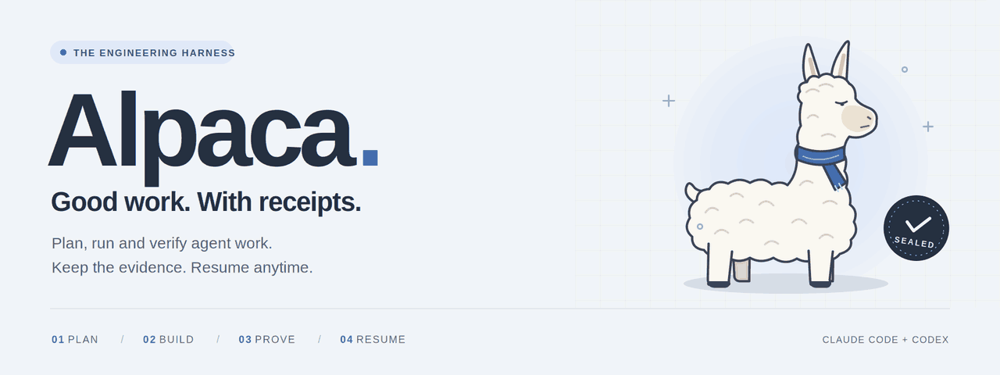
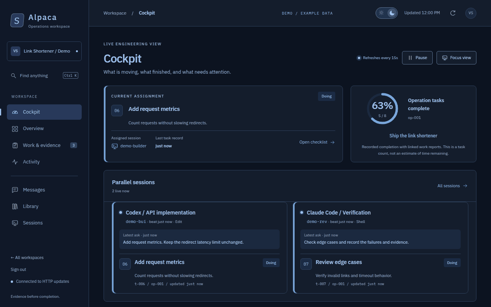
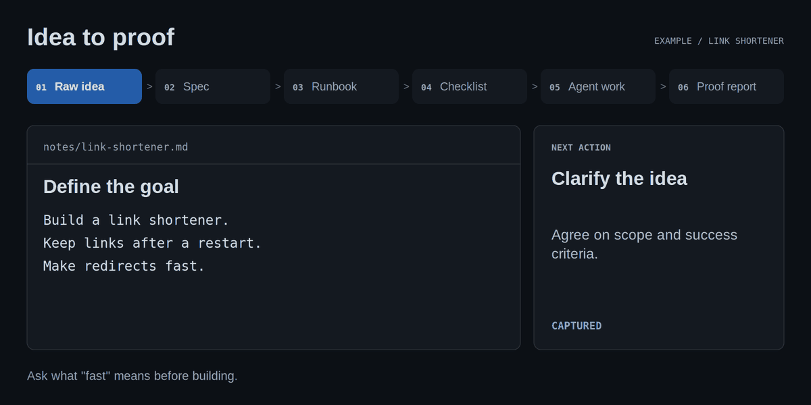
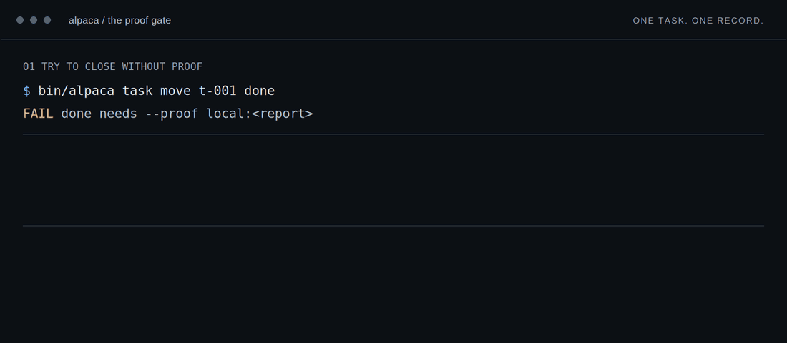
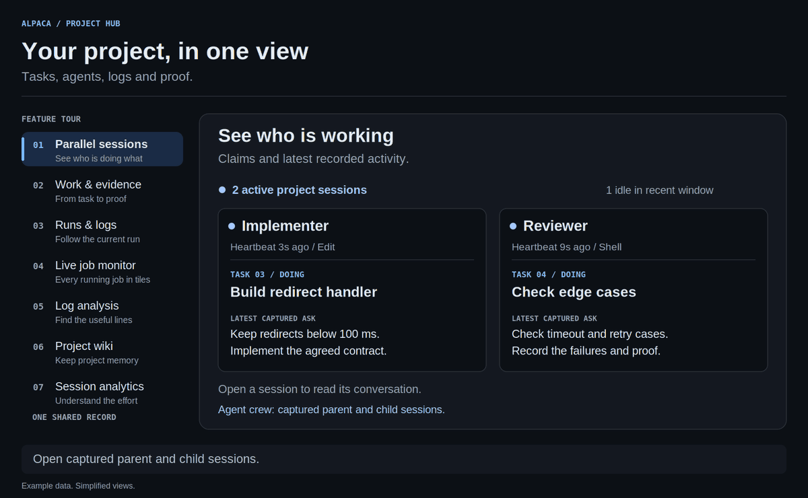
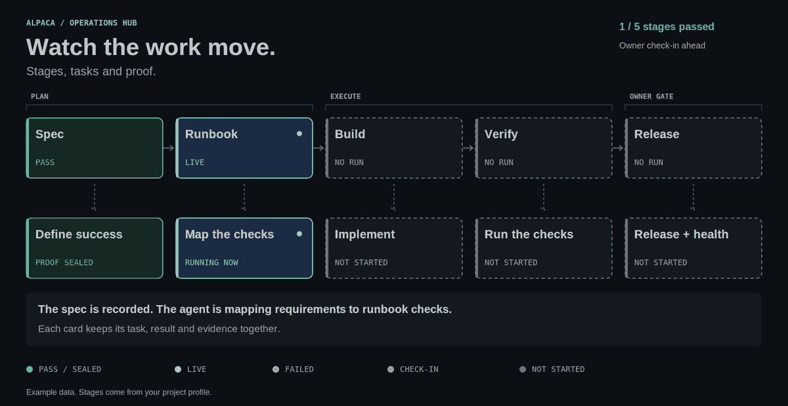
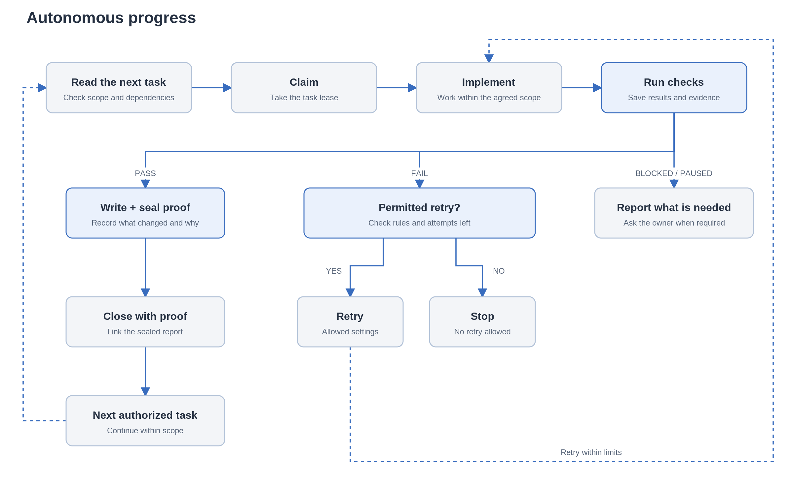
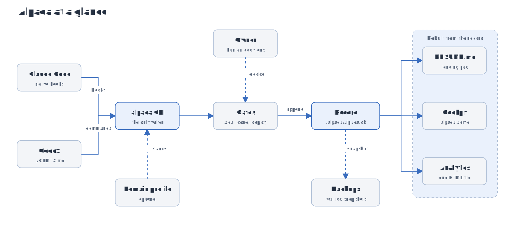
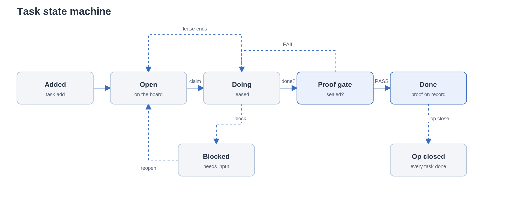

<p align="center">
  <picture>
    <source media="(prefers-reduced-motion: reduce)" srcset="docs/assets/banner.svg">
    
  </picture>
</p>

<p align="center">
  <a href="LICENSE"></a>
  
  
  
</p>

<p align="center">
  <a href="#quickstart"><b>Quickstart</b></a> &middot;
  <a href="#see-the-cockpit-in-action"><b>Cockpit demo</b></a> &middot;
  <a href="#from-idea-to-proof"><b>Idea to proof</b></a> &middot;
  <a href="#watch-it-in-the-hub"><b>The hub</b></a> &middot;
  <a href="#autonomous-progress"><b>Autonomous progress</b></a> &middot;
  <a href="MANUAL.md"><b>Read the manual</b></a>
</p>

# Start with an idea. Finish with proof.

**Alpaca is the engineering studio around your coding agents.** It helps Claude Code and Codex plan, run and verify work, where you already use them: the terminal, the desktop app or your IDE. It keeps tasks, decisions and evidence in one local record. Follow progress in the hub and resume across sessions.

## Problems Alpaca solves

| Without a shared work record | With Alpaca |
| --- | --- |
| Several agent tabs, no clear owner for each task. | See parallel sessions, task claims and recent activity together. |
| A new session has to reconstruct what happened. | Resume from recorded work, decisions and the next action. |
| "Done" has no test results or evidence attached. | Close tasks with sealed reports and linked evidence. |
| Agents retry without a clear stopping point. | Runbooks define allowed changes, retry limits and owner gates. |
| Plans, logs and results are scattered. | Trace a requirement through its task, checks and proof. |
| Switching between Claude Code and Codex splits the context. | Both use the same local project record. |

## See the cockpit in action

Follow two parallel sessions, open the work queue, then inspect a task's contract and proof.

<p align="center">
  <picture>
    <source media="(prefers-reduced-motion: reduce)" srcset="docs/assets/cockpit-demo.png">
    
  </picture>
</p>

<sub>Captured from the shipped interface with fictional data and blue presentation colors. [Watch the video](docs/assets/cockpit-demo.webm) &middot; [Full-size screenshot](docs/assets/cockpit-demo.png).</sub>

## From idea to proof

**Raw idea &rarr; spec &rarr; runbook &rarr; checklist &rarr; agent work &rarr; proof report.**

<p align="center">
  <picture>
    <source media="(prefers-reduced-motion: reduce)" srcset="docs/assets/workflow.svg">
    
  </picture>
</p>

<sub>Link-shortener example with illustrative results. [Replay or enlarge](docs/assets/workflow.gif) &middot; [View the still](docs/assets/workflow.svg).</sub>

| Step | What happens |
| --- | --- |
| **1. Idea** | Save the notes. Clarify the goal, constraints and owner decisions. |
| **2. Spec** | Write testable requirements. Use spec-kit for new work or OpenSpec for changes. |
| **3. Runbook** | Define commands, dependencies, checks, retry limits and owner gates. |
| **4. Checklist** | Intake creates requirement rows, task contracts and profile stages. |
| **5. Agent work** | Claim a task, implement, run checks and retry within the approved limits. |
| **6. Proof** | Write and seal the report. Close the task with its proof, then continue. |

Start from notes:

```sh
bin/alpaca start notes/link-shortener.md --prepare
```

This prepares the spec tools and prints the next steps for the agent. Claude Code also has `/alpaca-from-notes`.

### One requirement, end to end

The [example spec](templates/runbook-example/spec.md) requires **SC-002: redirect p95 <= 50 ms at 200 requests/second**. Its [runbook](templates/runbook-example/runbook.yaml) maps that requirement to a load test and `out/load.json`.

| Attempt | Example result | Next action |
| --- | --- | --- |
| 1: two workers | 68.4 ms, **FAIL** | Save the failure. Apply the permitted retry. |
| 2: four workers | 41.2 ms, **PASS** | Save the evidence. Write the report. |

The runbook allows three attempts and worker-count changes. The latency limit and request rate stay fixed. Wrong status codes, missing inputs or exhausted retries stop the path.

### What the proof contains

Every report opens with an **At a glance** summary of 40 to 600 characters, then covers **what changed, how, where, the result, issues, reproduction steps and evidence**. Failed attempts stay in the report.

Sealing checks completeness and hashes the evidence. Tests and review establish correctness. Closing a task requires a report sealed for that task.

Checklist rows can pass through recorded checks or owner decisions; manual closure requires a sealed report for the row. Closing a task does not automatically close its requirements.

[Full runbook example](templates/runbook-example/runbook.yaml) &middot; [Spec-to-checklist guide](docs/intake.md) &middot; [Proof commands](MANUAL.md)

## See the proof gate

A task can close only with a sealed proof report.

<p align="center">
  <picture>
    <source media="(prefers-reduced-motion: reduce)" srcset="docs/assets/terminal.svg">
    
  </picture>
</p>

<sub>Illustrative CLI excerpt for an already claimed task. [Still demo](docs/assets/terminal.svg) &middot; [Still banner](docs/assets/banner.svg)</sub>

<details>
<summary><b>Read the demo as text</b></summary>

```sh
# A claimed task cannot close without a sealed proof report.
bin/alpaca task move t-001 done
# FAIL: done needs --proof local:<report>

# Create the report, then fill in what changed, the result, and the evidence.
bin/alpaca proof new t-001
# Edit .alpaca/proofs/op-001/t-001.md before sealing it.
bin/alpaca proof seal t-001
# PASS: the completed report and its evidence are sealed.

bin/alpaca task move t-001 done --proof local:.alpaca/proofs/op-001/t-001.md
# t-001 -> done
```

</details>

## Quickstart

From a git clone (Python 3.10 or newer with venv support):

```sh
git clone <repository-url> my-project
cd my-project
bash setup/bootstrap.sh
bin/alpaca onboard --name my-project --who alex:owner --what "One line on what this project builds"
bin/alpaca doctor
```

That is the whole install. Then open Claude Code or Codex in the folder.

Bootstrap creates a local Python environment inside the copy. It changes no global agent configuration.

<details>
<summary><b>Onboarding flags and notes</b></summary>

- `--who` takes `name:role` pairs, separated by commas.
- `--task "..."` adds one open task. Repeat it for more.
- `--preset plain-writing` turns on the plain-writing rules.
- Answers go into the shipped `project.yaml`. Every other key stays.
- Onboarding keeps the template's `commands` (they build and test Alpaca itself) unless it finds a Makefile, a package.json or a pytest.ini of the project's own, so edit `commands` in project.yaml to name your project's build, test, lint and run.
- After onboarding, `bin/alpaca doctor` prints no ERROR line. The WARN "no transcript dir yet" clears after the first Claude Code session.

</details>

## Watch it in the hub

**See who is working, what is running and what passed.** Open tasks, logs, proof and captured conversations from one hub.

<p align="center">
  <picture>
    <source media="(prefers-reduced-motion: reduce)" srcset="docs/assets/hub-tour.svg">
    
  </picture>
</p>

<sub>Simplified views with example data. [Replay or enlarge](docs/assets/hub-tour.gif). Each feature below links to its still view.</sub>

| Explore | What you can inspect |
| --- | --- |
| **[Parallel sessions & agents](docs/assets/hub-tour.svg)** | Active sessions, task claims and recent activity. Open captured conversations and parent/child agent views. |
| **[Work & evidence](docs/assets/hub-tour-work.svg)** | Tasks in a timeline, cards or table. Open results and linked proof. |
| **[Runs & logs](docs/assets/hub-tour-runs.svg)** | Stage status, recorded attempts and live logs. Revisit any captured run. |
| **[Live job monitor](docs/assets/hub-tour-live.svg)** | Side-by-side job logs, errors, warnings and memory readings. Focus, pause or pin a tile. |
| **[Log analysis](docs/assets/hub-tour-logs.svg)** | Search errors and warnings, jump to source lines, and inspect profile-provided agent reviews. |
| **[Passive project wiki](docs/assets/hub-tour-wiki.svg)** | Captured session notes, intents and results with links to their sources. |
| **[Session analytics](docs/assets/hub-tour-analytics.svg)** | Tokens, estimated costs, context growth, tools and conversations. Trace measurements to source records. |

Session cards show recorded activity. Agent visibility depends on capture; a task claim alone does not prove the process is running.

Wiki capture runs through session lifecycle commands or the enabled collector. Raw notes need review before becoming trusted lessons. LLM extraction is off by default and requires a custom provider adapter.

<details>
<summary><b>Also in the hub: history, handoffs, reports and host health</b></summary>

| View | What it adds |
| --- | --- |
| **Cockpit & overview** | The current assignment, operation progress, recent completions, next action, acceptance status and profile-supplied stage cards. Pause updates or enter Focus view. |
| **Activity** | Filter the event history by work and checks, task and flow progress, or all recorded events. Open the original recorded context. |
| **Messages & handoffs** | Browse recorded reports and handoffs by recipient or message type, with links back to their tasks and sessions. |
| **Report library** | Browse project reports, proofs and decisions; preview Markdown or sandboxed HTML and download the source. |
| **Host load & capture health** | Inspect CPU and memory readings alongside collector, capture and projection status. Host load is separate from work progress. |
| **Workspace navigation** | Search pages, work items and reports with Ctrl+K / Cmd+K, use light or dark themes, and browse on mobile. The optional [host-hub publisher](docs/host-hub.md) adds this project's summary tile to a separately configured shared hub. |

</details>

[Read the hub guide](docs/operations-hub.md) &middot; [Explore the wiki commands](MANUAL.md#knowledge)

### Follow the runbook

Follow stages, task cards and proof through a failure, retry and owner check-in.

<p align="center">
  <picture>
    <source media="(prefers-reduced-motion: reduce)" srcset="docs/assets/hub.svg">
    
  </picture>
</p>

**Pale blue:** passed / sealed. **Bright blue:** running. **Red:** failed. **Amber:** owner check-in. Outlined cards have not started.

<sub>Example data. Stages come from your project profile. [Replay or enlarge](docs/assets/hub.gif) &middot; [Still view](docs/assets/hub.svg) &middot; [Hub guide](docs/operations-hub.md).</sub>

## Autonomous progress

Set the scope and autonomy level. The agent takes the next task, runs checks, follows allowed retries and records the result.

<picture>
  <source media="(prefers-color-scheme: dark)" srcset="docs/assets/autonomy-dark.png">
  
</picture>

The next session reads `RESUME.md`, checks for running jobs and existing claims, then resumes from the record.

| The agent can continue when... | It hands control back when... |
| --- | --- |
| The next action is within the authorized level and scope | A fork or scope boundary requires a decision at that level |
| Inputs and dependencies are ready | A needed input is missing or a blocker prevents a valid check |
| A retry is explicitly permitted and still within its limits | Attempts are exhausted or a stop condition is met |
| Completed work has the required proof | An owner gate, shipment or irreversible external action needs approval |

A fresh install starts at **L2**. At **L4**, the agent works autonomously inside one declared scope and verifies its work. The [full level table](#autodrive-levels) explains the other postures. The owner sets the level; the agent cannot raise its own.

Alpaca is domain-neutral. Set a `profile:` in `project.yaml` to bring your own stages and acceptance cards, or use the generic harness as it comes.

### Architecture

<picture>
  <source media="(prefers-color-scheme: dark)" srcset="docs/assets/architecture-dark.png">
  
</picture>

- Agents talk to one CLI.
- The CLI writes one record.
- Gates stand in between.
- Views are rebuilt from the record.

### The task state machine

<picture>
  <source media="(prefers-color-scheme: dark)" srcset="docs/assets/task-fsm-dark.png">
  
</picture>

| Move | Rule |
| --- | --- |
| `claim` | Only from `open`. Takes a lease. |
| lease ends | The task goes back to `open`. |
| `done` | Needs a sealed proof report. |
| `op close` | Blocked while any task is not done. |

## What's inside

<table>
  <tr>
    <td width="50%" valign="top">
      <h3>&#x1F4D2; Record and resume</h3>
      One append-only record per project.<br>Each session opens on <code>RESUME.md</code>.
    </td>
    <td width="50%" valign="top">
      <h3>&#x1F50F; Sealed proof reports</h3>
      Write it, seal it, close with it.<br>Failed attempts stay on the record.
    </td>
  </tr>
  <tr>
    <td valign="top">
      <h3>&#x1F6A6; Gates with exit codes</h3>
      <code>0</code> PASS &middot; <code>1</code> FAIL &middot; <code>2</code> BLOCKED &middot; <code>3</code> PAUSED<br>Scripts and agents read the same verdict.
    </td>
    <td valign="top">
      <h3>&#x1F4CA; Cockpit and analytics</h3>
      <code>alpaca serve</code> runs the hub and cockpit.<br>Analytics is one HTML file that reads on a phone.
    </td>
  </tr>
  <tr>
    <td valign="top">
      <h3>&#x1F4DD; From notes to a runbook</h3>
      <code>alpaca start &lt;notes&gt;</code> turns notes into a spec, a runbook and tasks.<br>spec-kit and OpenSpec ship offline.
    </td>
    <td valign="top">
      <h3>&#x1F6E1;&#xFE0F; Barrier and clean shipping</h3>
      A pre-push barrier scans every outgoing object.<br>Reproducible archives, verified backups.
    </td>
  </tr>
</table>

Also in the box:

- **Formations** for work that needs more than one agent: `solo`, `builder-verifier`, `fan-out`, `bug-loop`, `nuclear`, `napalm`.
- **Claude Code skills**, ready in any clone: `/alpaca-first-chat`, `/alpaca-onboard`, `/alpaca-op`, `/alpaca-from-notes`, `/alpaca-interview`, `/alpaca-runbook-forge`, `/alpaca-log-review`.

## Autodrive levels

Autonomy is one ladder. You set the level; an agent may drop to a safer rung but never raises its own. A fresh install runs at **L2**.

| Level | Name | What the agent does | What you do |
| --- | --- | --- | --- |
| L1 | Assist | Investigates and hands over ready-to-run changes; writes nothing | Apply every change |
| L2 | Partial | Makes single bounded edits, one at a time | Approve each edit |
| L3 | Conditional | Runs a task end to end, hands back at every fork or irreversible step | Decide at the forks |
| L4 | High | Works alone inside one declared scope and checks its own work | Set the scope |
| L5 | Full | Plans and runs the whole task, reports what it could not finish | Read the end report |
| L6 | Never-defer | Pursues the goal until the goal marker is written | Set the goal, stop it any time |

Ship, release close, and irreversible external actions stay human decisions at every level.

## Docs

| Read this | For |
| --- | --- |
| [`MANUAL.md`](MANUAL.md) / [`docs/manual.html`](docs/manual.html) | Every verb, daily use, the hooks, troubleshooting (the HTML copy reads on a phone) |
| [`docs/DESIGN.md`](docs/DESIGN.md) | Architecture: the record, adapters, proofs, profiles, views |
| [`docs/operators.md`](docs/operators.md) | Claude Code and Codex side by side |
| [`docs/operations-hub.md`](docs/operations-hub.md), [`docs/host-hub.md`](docs/host-hub.md) | The hub, the cockpit, sign-in |
| [`docs/observability-operations.md`](docs/observability-operations.md) | The collector, artifacts, backup and restore |
| [`docs/runbook-format.md`](docs/runbook-format.md), [`docs/intake.md`](docs/intake.md) | Runbooks and turning a spec into work |
| [`docs/shipping.md`](docs/shipping.md), [`docs/DEPLOY.md`](docs/DEPLOY.md) | Packaging and moving Alpaca to another machine |

<details>
<summary><b>Start from a release archive</b></summary>

1. Extract the release archive and enter its directory. The directory may be renamed.
2. Run `bash setup/bootstrap.sh`. This creates a local Python environment inside this copy and installs nothing else. Python 3.10 or newer with venv support is required.
3. Open Claude Code or Codex in that directory. For a shell check, run `bin/alpaca --help`, then `bin/alpaca doctor`.
4. The first chat runs onboarding: answer the questions, run `bin/alpaca onboard ...` once (flags as in the Quickstart), then `bin/alpaca doctor`.

Claude Code has native lifecycle hooks. Codex follows AGENTS.md and uses explicit lifecycle commands. Both write one local Alpaca record. No global agent configuration is modified.

</details>

<details>
<summary><b>What ships in the box</b></summary>

- `alpaca/`, `bin/alpaca`, `ALPACA-MANIFEST`: the harness mechanisms. `alpaca/` is the Python package; its self-tests live in `alpaca/tests/`.
- `.alpaca/`: fresh per-installation runtime created on use; never shipped.
- `MANUAL.md` and `docs/manual.html`: command reference and phone-readable manual.
- `doctrine/`, `MAP.md`, `contracts/`, `formations/`: the rules, the boot router, and the work shapes.
- `.claude/skills/alpaca-*`: Alpaca's own skills (`/alpaca-first-chat`, `/alpaca-onboard`, `/alpaca-op`, `/alpaca-from-notes`, `/alpaca-interview`, `/alpaca-runbook-forge`, `/alpaca-log-review`). They are project skills, so Claude Code offers them in any clone with nothing to install.
- `plugin/alpaca/`: optional bundled skills (load with `claude --plugin-dir ./plugin/alpaca`, see `docs/operators.md`).
- `docs/runbook-format.md`, `templates/runbook-example/` and `/alpaca-runbook-forge`: the runbook format (a domain's stages, checks, knobs, retry rules and owner gates), a worked example, and the skill that writes a runbook from a spec. `alpaca runbook check` checks one.
- `alpaca intake <spec> <runbook>`: turns a spec-kit or OpenSpec spec and its runbook into the op's checklist rows (one per success criterion, edge case or scenario, each with its bar), one task contract per stage and per owner gate (none for a recovery stage), and the profile stages; after a spec or runbook change it supersedes only the rows whose criterion or bar changed. `--dry-run` shows the plan. See `docs/intake.md`.
- `/alpaca-from-notes` and `alpaca start <notes>`: the one entry point from raw notes. It picks spec-kit for a new thing and OpenSpec for a change (you can override), then walks the notes to a spec, a runbook and intake.
- `alpaca note`, `alpaca interview` and `/alpaca-interview`: raw notes go to an inbox (`input/notes/`), and an interview in rounds of questions settles every slot a runbook needs (done bar, numbers, edge cases, failures, what must never happen, owner gates), reads it back and signs it off before the spec step. See `docs/interview.md`.

</details>

<details>
<summary><b>Choices kept on purpose</b></summary>

- The wiki's generic marking rules keep their Vietnamese text. `alpaca/wiki/ingest/firewall.py` matches classification markings in several languages (Chinese, Russian and Vietnamese next to the English ones), and `alpaca/wiki/engine/echo.py` reads Vietnamese attribution cues next to the English ones. The text is there so those markings and cues are caught; it is not a leftover.
- There is no migration path from an install of the earlier internal harness that Alpaca grew from. Start a project from a fresh clone of Alpaca and onboard it; a record from that earlier install is not converted.

</details>

## Development

```sh
bin/alpaca-python -m pytest                 # the regression suite
bin/alpaca-python setup/ship.py --help      # clean, reproducible packaging
```

<details>
<summary><b>Rebuild the README animations</b></summary>

The mascot and terminal artwork live in `docs/assets/banner.svg` and `docs/assets/terminal.svg`. The workflow storyboard lives in `docs/assets/workflow.json`; the renderer produces `workflow.gif` and its static `workflow.svg`. The simplified stage map uses `docs/assets/hub.json`, rendered to `hub.gif` and `hub.svg`. The feature tour uses `docs/assets/hub-tour.json` and the scene layouts in `setup/render_readme_assets.py`, rendered to `hub-tour.gif` and one SVG per feature. The architecture, task-state and autonomous-progress diagrams use the models in `docs/assets/diagrams/`, rendered to SVG and PNG in both themes. The README uses GIFs for motion, SVGs for reduced motion, and text explanations for every animation.

Install the optional artwork tools in a separate environment, then render:

```sh
python3 -m venv .alpaca/artwork-venv
.alpaca/artwork-venv/bin/pip install CairoSVG Pillow
.alpaca/artwork-venv/bin/python setup/render_readme_assets.py
# Or rebuild just the workflow:
.alpaca/artwork-venv/bin/python setup/render_readme_assets.py --only workflow
# Or the compact hub preview:
.alpaca/artwork-venv/bin/python setup/render_readme_assets.py --only hub
# Or the architecture, task and autonomous-progress diagrams:
.alpaca/artwork-venv/bin/python setup/render_readme_assets.py --only diagrams
# Or the seven-part feature tour:
.alpaca/artwork-venv/bin/python setup/render_readme_assets.py --only hub-tour
```

To recapture the cockpit demo, install Playwright and Pillow in that environment, then run:

```sh
.alpaca/artwork-venv/bin/pip install playwright Pillow
.alpaca/artwork-venv/bin/playwright install chromium ffmpeg
.alpaca/artwork-venv/bin/python setup/capture_readme_cockpit.py
```

The capture uses the shipped web interface and `setup/readme_cockpit.json` example responses. It reads no live project data and serves every browser request locally.

CairoSVG needs Cairo on the host. The renderer uses system Arial-compatible sans and DejaVu Sans Mono fonts. These tools are only needed to edit the artwork; using Alpaca needs no extra packages.

</details>

Never ship a live directory with `cp -r`. The exporter excludes sessions, evidence, tool installs, caches, local settings and worktrees; third-party notices travel with the package.

## License

MIT, see [`LICENSE`](LICENSE). Bundled third-party pieces (IBM Plex fonts, spec-kit, OpenSpec and others) keep their own licenses, listed in [`THIRD-PARTY-NOTICES.md`](THIRD-PARTY-NOTICES.md).
